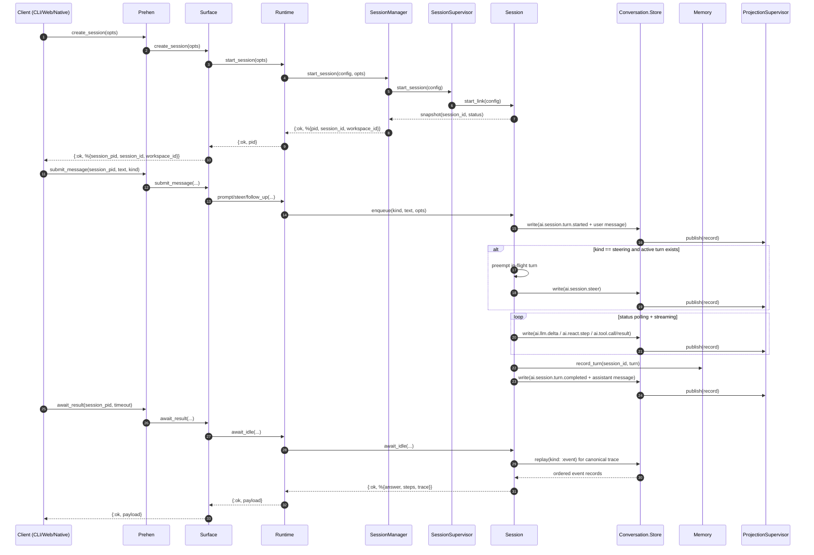

# Prehen Current Architecture (As-Is)

_Last updated: 2026-02-20_

本文件描述当前代码实现的系统结构（as-is），用于：
- 帮助理解当前复杂度来源；
- 作为重构前后的对照基线；
- 与 `openspec/changes/*` 中的变更设计形成“现状 vs 目标”的分工。

## 1. 分层总览

当前主链路按以下层次组织：

1. `Prehen`（public API facade）
2. `Prehen.Client.Surface`（统一客户端 contract）
3. `Prehen.Agent.Runtime`（runtime facade）
4. `Prehen.Workspace.SessionManager`（control plane）
5. `Prehen.Agent.Session`（data plane）
6. `Prehen.Conversation.Store` + `SessionLedger` + `Prehen.Memory`（事实流与记忆）

简化关系图：

```text
CLI/Web/Native
    |
    v
Prehen
    |
    v
Prehen.Client.Surface
    |
    v
Prehen.Agent.Runtime
    |-------------------------------> Prehen.Events (subscribe/replay facade)
    |
    +--> Prehen.Workspace.SessionManager (control plane)
    |        |
    |        +--> Prehen.Workspace.SessionSupervisor
    |                 |
    |                 +--> Prehen.Agent.Session (one process per session)
    |
    +--> Prehen.Conversation.Store (ledger-first event/message stream facade)
    |        |
    |        +--> Session ledger files (`./.prehen/sessions/<session_id>.jsonl`)
    +--> Prehen.Memory (STM + LTM adapter contract)
```

## 2. 组件职责

### 2.1 `Prehen`（统一入口）
- 仅做 API 暴露与转发，统一走 `Surface`。
- 不承担业务编排逻辑。

### 2.2 `Prehen.Client.Surface`（client contract）
- 给 CLI/Web/Native 提供统一会话接口：`create_session` / `submit_message` / `await_result` / `session_status` / `stop_session` / `subscribe_events`。
- 统一错误形态与超时语义（例如 `:timeout`、`:session_unavailable`）。
- 提供 `run/2` 一次性执行入口（CLI 兼容）。

### 2.3 `Prehen.Agent.Runtime`（runtime facade）
- 对外隐藏 `SessionManager` / `Session` 的内部细节。
- 暴露会话生命周期、回放、workspace capability 控制。
- 在 Jido backend 下统一走 session 路径。

### 2.4 `Prehen.Workspace.SessionManager`（control plane）
- 管理会话元数据：创建、索引、停止、workspace 归属。
- 不持有执行细节（执行态在 `Session` 进程内）。
- 管理 workspace capability packs，并做 idle sync/reclaim。

### 2.5 `Prehen.Agent.Session`（data plane）
- 每个会话一个进程，维护回合队列与 active turn。
- 处理 `prompt/steering/follow_up` 三类输入及优先级语义。
- 产出 typed events、消息记录、最终 trace/result。
- 回合边界写入 `Memory`（STM 主，LTM 可降级）。

### 2.6 `Prehen.Conversation.Store`（canonical facts）
- append-only 事实流 facade（event + message）。
- 每条记录分配 `seq` 并持久化到 `session_id.jsonl`。
- 语义为 persist-first（含 turn completed `file.sync` checkpoint）再 publish。
- replay 从持久化 ledger 读取；支持重启后回放。

### 2.7 `Prehen.Memory`（two-tier memory）
- STM：`session_id` 级短期记忆（`conversation_buffer`、`working_context`、`token_budget`）。
- LTM：通过 adapter contract 接口扩展；当前默认 `noop`。
- 读取策略：STM-first，LTM 失败降级不阻塞主流程。
- STM 可通过回放 `ai.session.turn.summary` 从 ledger 重建。

## 3. 核心数据处理流程

### 3.1 会话执行主流程（create -> submit -> await）



补充语义：
- `steering` 会抢占当前 in-flight turn，但不清空队列中的后续消息。

### 3.2 事件订阅与回放

1. `Store.write/*` 写入记录时同步 publish 到 `ProjectionSupervisor`。
2. 实时消费：`Events.subscribe/1`（`Surface.subscribe_events/1` 对外暴露）。
3. 历史回放：`Store.replay/2`（`Runtime.replay_session/2` / `Surface.replay_session/2` 暴露）。
4. 会话恢复：`resume_session` -> replay ledger -> 重建 STM -> 发出 `ai.session.recovered`。
5. `Session` 在构建最终 runtime result 时使用 ledger replay 生成 canonical trace。

### 3.3 Memory 读取流程（Orchestrator 场景）

1. Orchestrator 在 dispatch 前调用 `Memory.context/2` 加载上下文。
2. 返回结构包含：
   - `stm`：短期上下文；
   - `ltm`：可选长期上下文；
   - `source`：`stm_only | stm_plus_ltm | stm_ltm_degraded`。
3. dispatch 完成后调用 `Memory.record_turn/3` 写回新的 turn。

## 4. 关键数据结构（当前）

### 4.1 Correlation 字段
- `session_id`：会话级唯一标识
- `request_id`：单次请求标识
- `run_id`：同一运行链路标识
- `turn_id`：会话内回合序号

### 4.2 Store record（示意）

```elixir
%{
  session_id: "session_x",
  seq: 42,
  kind: :event | :message | :record,
  at_ms: 1730000000000,
  stored_at_ms: 1730000000100,
  # ... payload fields
}
```

### 4.3 Memory context（示意）

```elixir
%{
  session_id: "session_x",
  stm: %{
    conversation_buffer: [...],
    working_context: %{...},
    token_budget: %{limit: 8000, used: 1200, remaining: 6800},
    buffer_limit: 24
  },
  ltm: %{...} | nil,
  ltm_error: term() | nil,
  source: :stm_only | :stm_plus_ltm | :stm_ltm_degraded
}
```

## 5. 当前边界与约束

- 架构定位：平台化方向，支持 multi-session workspace 与可扩展 memory contract。
- LTM：当前阶段仅接口契约与 adapter 注册/选择，不提供默认持久化实现。
- 安全：MVP 阶段客户端直连，不包含认证/鉴权。
- 兼容策略：采用一次性切换，不维护长期双轨兼容。
- `trace_json`：当前以 `schema_version: 2` 为统一结构。
- ledger 默认目录：`./.prehen/sessions`。
- ledger 权限策略：目录 `0700`、文件 `0600`。
- 损坏 ledger 在恢复路径为硬失败（返回结构化恢复错误）。

## 6. 为什么会感到“复杂”

主要来自三类复杂度叠加：

1. 控制面与执行面分离
- `SessionManager`（control plane）和 `Session`（data plane）拆分后，语义更清晰，但模块数量上升。

2. 双存储路径并存
- `Conversation.Store`（事实流）与 `Memory`（推理上下文）在一次回合中会同时写入，职责不同但容易被误解为重复。

3. 事件驱动 + 队列抢占语义
- `steering` 抢占、工具调用状态流、最终 canonical trace 重建让流程更健壮，也提高了认知门槛。

## 7. 与 OpenSpec 的文档分工

- 本文件（`docs/architecture/current-system.md`）：维护“当前实现现状（as-is）”。
- `openspec/changes/*`：维护“目标方案与变更决策（to-be / delta）”。

建议维护规则：

1. 先在 OpenSpec 写变更决策；
2. 实现落地并验证后，同步更新本文件；
3. 避免把“现状”和“规划”混写在同一文档里。

## 8. 源码文件映射索引

| 层/主题 | 模块 | 源码文件 | 关键入口 | 说明 |
|---|---|---|---|---|
| Public API | `Prehen` | `lib/prehen.ex` | `run/2`, `create_session/1`, `submit_message/3` | 平台统一入口，转发到 `Surface` |
| Client Surface | `Prehen.Client.Surface` | `lib/prehen/client/surface.ex` | `create_session/1`, `resume_session/2`, `await_result/2`, `subscribe_events/1` | 给 CLI/Web/Native 提供统一 contract |
| Runtime Facade | `Prehen.Agent.Runtime` | `lib/prehen/agent/runtime.ex` | `start_session/1`, `resume_session/2`, `session_status/1`, `replay_session/2` | 隐藏会话内部编排细节 |
| Control Plane | `Prehen.Workspace.SessionManager` | `lib/prehen/workspace/session_manager.ex` | `start_session/2`, `list_sessions/1`, `set_workspace_capability_packs/2` | 会话元数据、workspace 策略、回收 |
| Session Proc Supervision | `Prehen.Workspace.SessionSupervisor` | `lib/prehen/workspace/session_supervisor.ex` | `start_session/2`, `stop_session/1` | 负责 `Session` 子进程生命周期 |
| Data Plane | `Prehen.Agent.Session` | `lib/prehen/agent/session.ex` | `prompt/3`, `steer/3`, `await_idle/2`, `snapshot/1` | 单会话执行引擎、队列与回合调度 |
| Event Projection | `Prehen.Agent.EventBridge` | `lib/prehen/agent/event_bridge.ex` | `project/2` | 统一 event envelope 结构 |
| Canonical Facts | `Prehen.Conversation.Store` | `lib/prehen/conversation/store.ex` | `write/2`, `write_many/2`, `replay/2` | ledger-first 事实流 facade（event/message） |
| Session Ledger | `Prehen.Conversation.SessionLedger` | `lib/prehen/conversation/session_ledger.ex` | `append/2`, `replay/1`, `sync/1` | 文件持久化 `<session_id>.jsonl` 与回放/校验 |
| Event Facade | `Prehen.Events` | `lib/prehen/events.ex` | `subscribe/1`, `replay/2` | 对客户端暴露订阅与回放 |
| Projection Bus | `Prehen.Events.ProjectionSupervisor` | `lib/prehen/events/projection_supervisor.ex` | `publish/1`, `subscribe/1` | 事件分发给投影消费者 |
| Memory Facade | `Prehen.Memory` | `lib/prehen/memory.ex` | `context/2`, `record_turn/3`, `put_working_context/3` | Two-tier memory 门面（STM + LTM contract） |
| STM | `Prehen.Memory.STM` | `lib/prehen/memory/stm.ex` | `ensure_session/2`, `record_turn/3`, `put_working_context/3` | 会话级短期记忆 |
| STM Projector | `Prehen.Memory.STMProjector` | `lib/prehen/memory/stm_projector.ex` | `rebuild/3` | 从 summary 事件回放重建 STM |
| LTM Adapter Registry | `Prehen.Memory.LTMAdapters` | `lib/prehen/memory/ltm_adapters.ex` | `register/2`, `fetch/1` | LTM adapter 注册与解析 |
| LTM Contract | `Prehen.Memory.LTM.Adapter` | `lib/prehen/memory/ltm/adapter.ex` | `get/2`, `put/3` callbacks | 长期记忆接口契约（MVP 暂不实现默认持久化） |
| Orchestration | `Prehen.Agent.Orchestrator` | `lib/prehen/agent/orchestrator.ex` | `route/2`, `dispatch/2` | 多 Agent 路由/派发（读取并写回 Memory） |
| App Wiring | `Prehen.Application` | `lib/prehen/application.ex` | `start/2`, `health/0` | 根监督树与健康检查聚合 |
